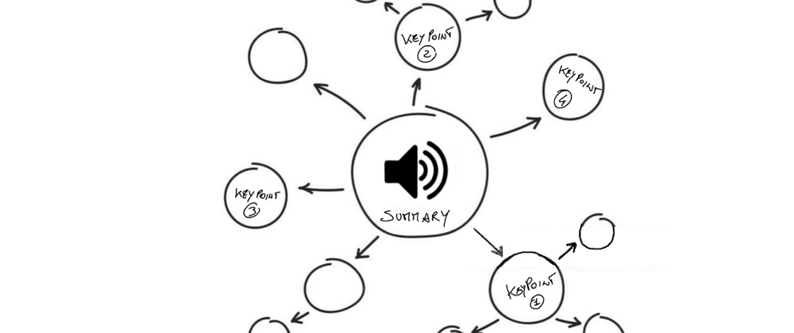
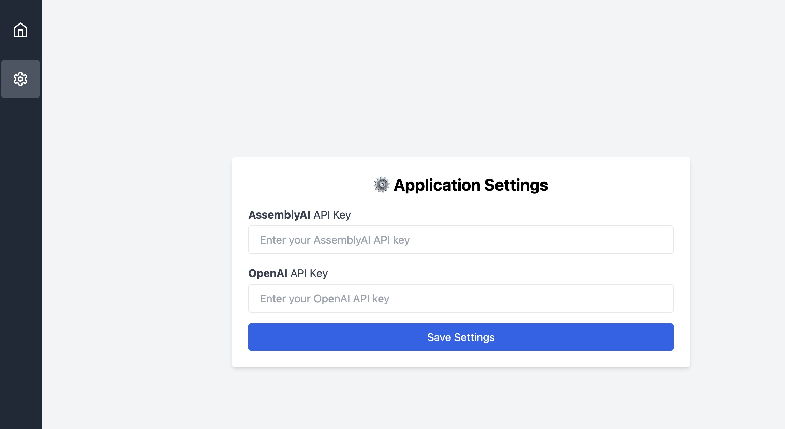
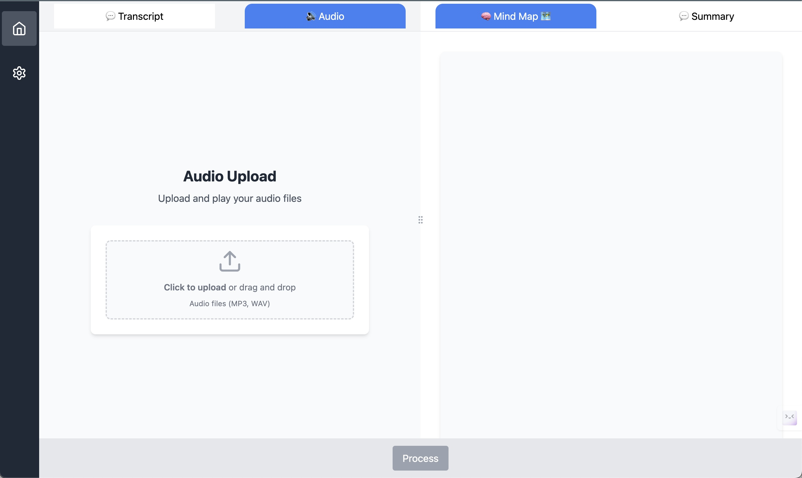
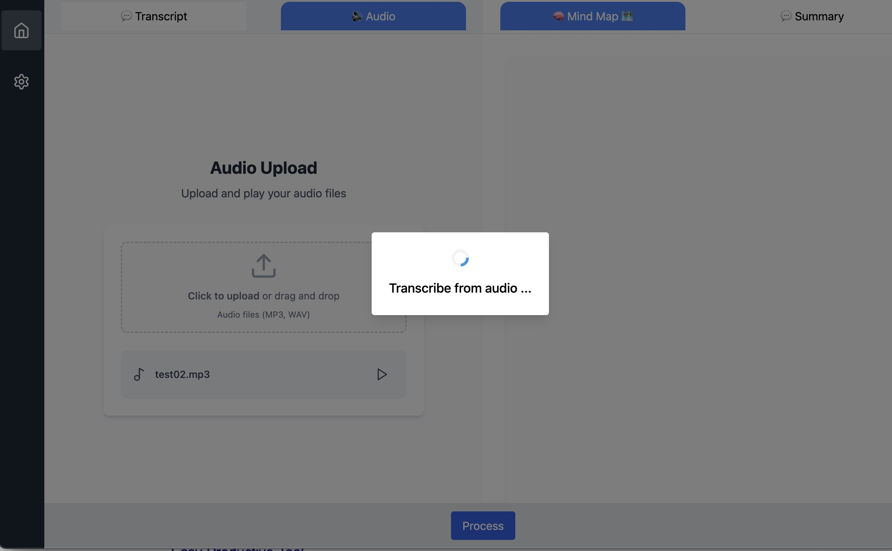
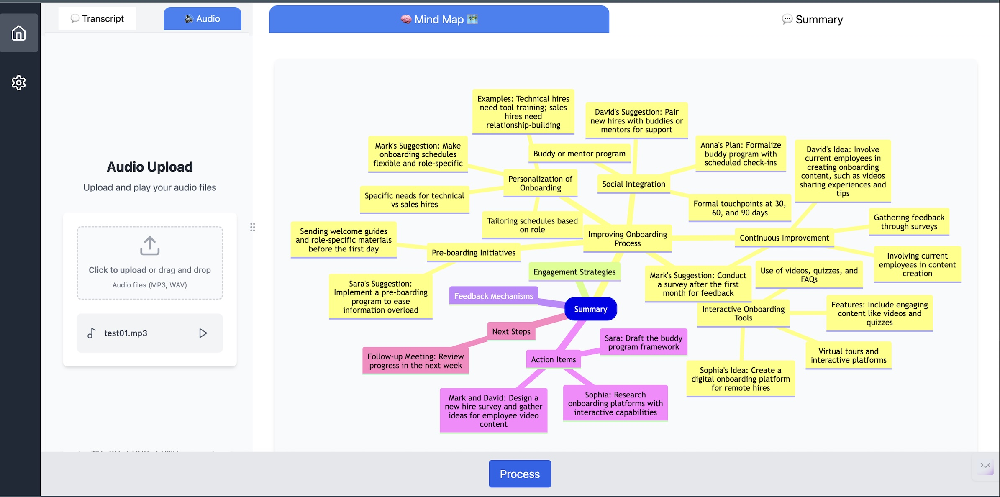

[
# MapifyAI
From a Audio or Transcription to Mind-Map Diagram with this AI-powered tool

*This project has been submitted to [AssemblyAI Challenge ](https://dev.to/challenges/assemblyai): Sophisticated Speech-to-Text.*

## What I Built
An Application that allow from an Audio concerning a discussion, a meeting, etc ... to generate a "_meaningful mind-map diagram_", that represent the touched key points. This representation joined with summary provide a more complete and understandable informations 

## Demo

The application in available [here](https://bsorrentino.github.io/MapifyAI/) for access to full functionality you need both an [AssemblyAI] Api Key and a [OpenAI] Api Key. Below there are some representative screenshots

### Settings 

### Upload Audio

### Transcribe Audio 

### Generate Mindmap Diagram
 

## Journey
To implement process from audio to diagram I have create several skilled agents described below:

1. **transcribe-from-audio**: this agent _use AssemblyAI transcripts API_ to transcribe the provided audio.

1. **keypoints-from-transcript**: this Agent use OpenAI (_got-4o-mini_) to extract the Keypoints inside the given transcription

1. **summary-to-mindmap**: this agent use OpenAI (_got-4o-mini_) to arrange the key points in a kind of ontology providing a hierarchical representation of information

1. **mindmap-to-mermaid**: last agent transform the mind-map representation in a [mermaid](https://mermaid.js.org) syntax ready for the visualization

[AssemblyAI]: https://www.assemblyai.com
[OpenAI]: https://openai.com/api/

